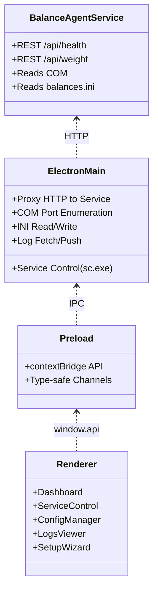
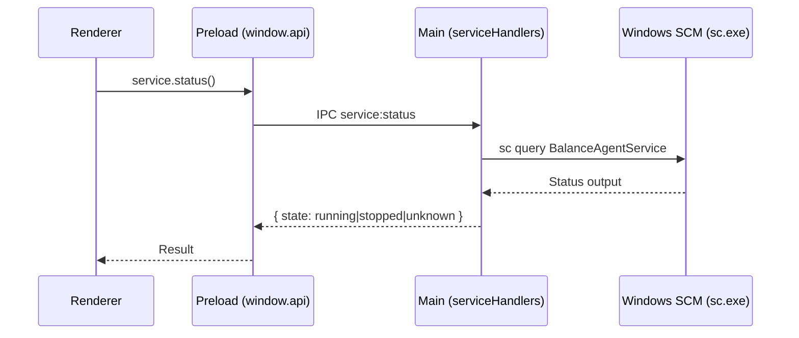
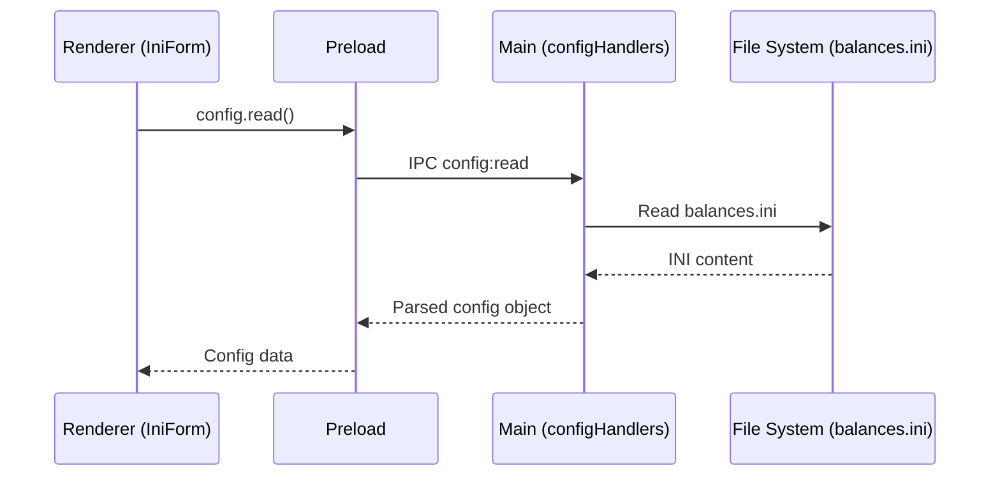
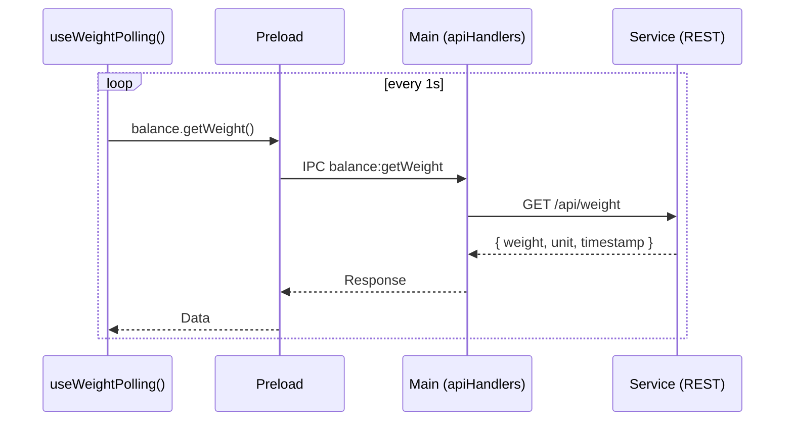
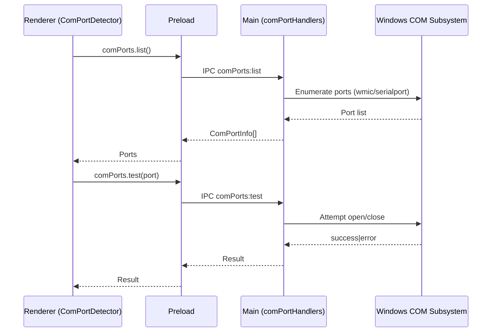
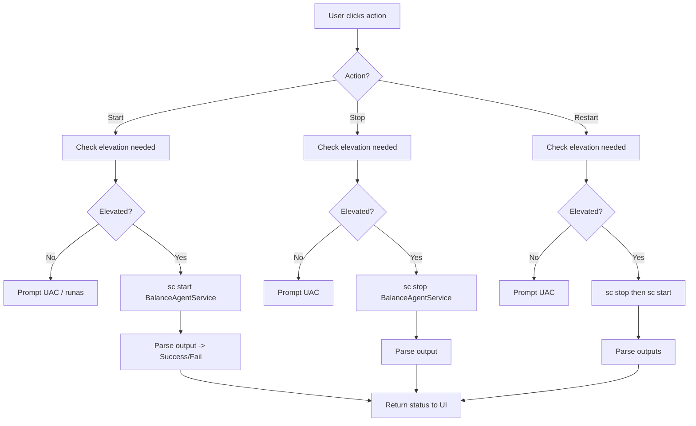
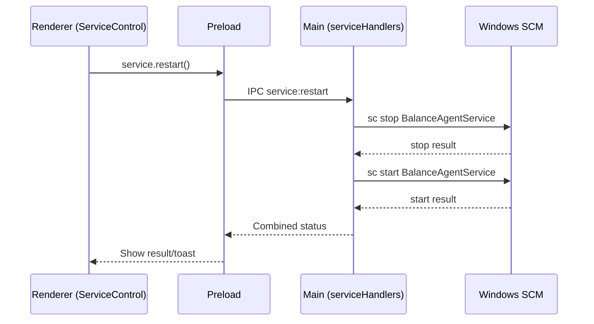
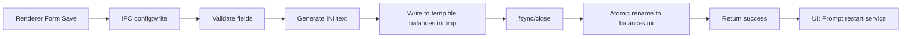
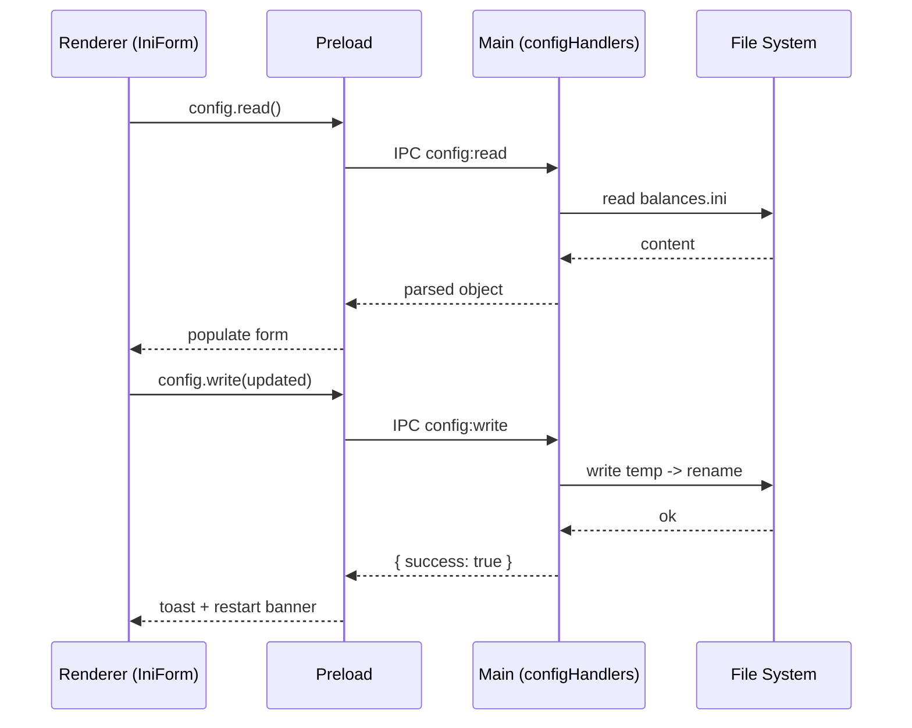
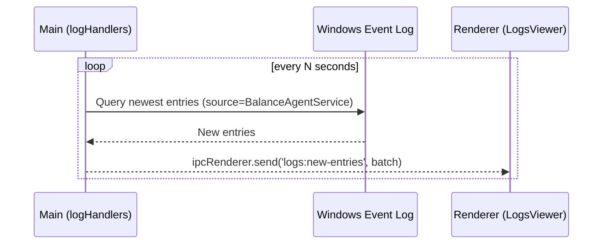

# Planification___Industrial_Weighing_Dashboard.md

---

## 1. Project Overview

- Type: Hybrid desktop application ecosystem for industrial weighing, composed of:
  - A .NET Windows Service (BalanceAgentService) interfacing with serial COM scales and exposing a REST API.
  - An Electron + React + TypeScript desktop client (balance-dashboard) for monitoring, control, configuration, and logs.
  - A Python-based scale simulator (ScaleSimulator) for development/testing.

- Goal: Provide an operator-facing dashboard to:
  - Observe live weight readings and historical trends.
  - Manage and monitor the BalanceAgentService (start/stop/restart, health).
  - Configure scale communication via balances.ini (COM parameters, units, decimals, device count).
  - Inspect logs and troubleshoot connectivity or service issues.

- Target users:
  - Industrial operators and line technicians.
  - System integrators/IT admins managing Windows services.
  - QA/testing engineers using simulated scales for validation.

---

## 2. Architecture & Structure

### High-Level Architecture

- Scale Device(s) communicate via serial COM.
- BalanceAgentService (Windows Service) reads serial data and exposes a REST API at <http://localhost:5001> (confirmed endpoint: GET /api/health). Configuration resides in balances.ini.
- Electron App:
  - Main process handles OS integrations: service control (sc.exe), INI file I/O, COM port enumeration, HTTP proxying to service API, log retrieval.
  - Preload process exposes a safe, typed IPC bridge to the renderer.
  - Renderer (React) provides UI for dashboard, service control, configuration editor, COM tools, logs, and a setup wizard.

### Communication and Data Flow

- Renderer → Main: IPC calls over well-defined channels (see shared/ipcChannels.ts).
- Main → Service: HTTP requests to REST endpoints (health, weight, history).
- Main → OS:
  - Service control via Windows Service Control Manager (sc.exe), potentially requiring elevation.
  - COM port enumeration via WMIC or Node serialport (implemented via utilities in electron/main/utils/comPorts.ts).
  - Logs via Windows Event Log or service-emitted history files (backed by historyManager utilities).
- Main → Renderer: Push channels for logs and live updates (registered in electron/main/ipc/* handlers).

### Relevant Diagrams

While no image files are present, the repository structure and IPC modules imply:

- IPC Contract Layer (shared/ipcChannels.ts) defines stable channel names to avoid stringly-typed errors.
- Main IPC Handlers:
  - apiHandlers.ts (service HTTP proxy)
  - serviceHandlers.ts (service lifecycle)
  - configHandlers.ts (ini read/write)
  - comPortHandlers.ts (serial enumeration/testing)
  - logHandlers.ts (event or file logs)
  - historyHandlers.ts (weight/history persistence)

---

## 3. Technical Stack

- Languages:
  - TypeScript (Electron main, preload, renderer)
  - JavaScript/TypeScript tooling (Vite, ESLint, Tailwind)
  - Python (scale simulator)
  - INI configuration (balances.ini)
  - Batch/Windows tooling (install.bat)

- Frameworks/Libraries:
  - Electron + electron-vite for application bundling and dev flow.
  - React for UI.
  - Tailwind CSS for styling.
  - Zustand for state management (src/renderer/store/appStore.ts).
  - Recharts or custom charting (src/components/LiveWeightChart.tsx).
  - electron-builder for packaging (electron-builder.json).

- Dev/Build Tools:
  - Vite and electron-vite configuration (vite.config.ts, electron/vite config).
  - Vitest/Playwright for tests (vitest.config.ts, test/).
  - ESLint (eslint.config.js).
  - PostCSS/Tailwind (postcss.config.cjs, tailwind.config.js).

- OS Integrations:
  - Windows Service control (sc.exe) via child_process.
  - COM Port enumeration (wmic or serialport lib).
  - Event Log access via PowerShell or log file history.

- Service Endpoint:
  - REST at <http://localhost:5001> (GET /api/health is confirmed).
  - Additional inferred endpoints for weight and history are proxied by main ipc apiHandlers.ts.

---

## 4. Features & Functionality

- Dashboard
  - Live weight display (components/WeightGauge.tsx).
  - Live trend chart (components/LiveWeightChart.tsx).
  - Status indicators (components/StatusBadge.tsx).
  - Connection and health reporting.

- Service Control
  - Start/Stop/Restart BalanceAgentService (renderer/pages/ServiceControl.tsx wired to IPC service handlers).
  - Status polling and feedback.

- Configuration Manager
  - Edit balances.ini parameters (port, baud rate, data bits, parity, stop bits, timeout, unit, decimals, number of balances).
  - Read/write cycle via IPC to main/configHandlers and utils/iniConfig.ts.
  - Validation and restart guidance.

- COM Port Tools
  - Enumerate COM ports (renderer/pages/ComPortDetector.tsx, main/utils/comPorts.ts, main/ipc/comPortHandlers.ts).
  - Potential test connection flow to validate selected port (renderer integration; testing facilitated through main process).

- Logs & History
  - Logs viewer (renderer/pages/LogsViewer.tsx) with potential filters and severity highlighting.
  - History table (renderer/components/BalanceHistoryTable.tsx) for recent weight records.
  - Main-side handlers: logHandlers.ts and historyHandlers.ts with utils/historyManager.ts.

- Setup Wizard
  - Onboarding workflow (renderer/pages/SetupWizard.tsx):
    1) Welcome
    2) Detect COM Ports
    3) Test Scale Connection
    4) Configure API Settings
    5) Install/Configure Service
    6) Finish

- Updates
  - App update experience components (src/components/update/*, AppUpdater.tsx) paired with electron/main/update.ts and type/electron-updater.d.ts.

- Testing
  - E2E smoke tests and screenshots (test/).

---

## 5. Key Files & Code Highlights

- Top-Level
  - balances.ini: Runtime configuration for serial/scale parameters used by the service.
  - install.bat: Windows batch script for installing the service via SCM.
  - BalanceAgentService.sln: .NET solution for the Windows Service (source for the service itself is not included here but referenced).
  - Planification___Industrial_Weighing_Dashboard.md: Strategy document guiding the Electron app’s design.
  - README.md: Project/home-level documentation.
  - ScaleSimulator/: Python-based simulator for test environments.

- Electron (balance-dashboard/)
  - electron/main/index.ts: Main entry, BrowserWindow creation, wiring IPC.
  - electron/main/ipc/*:
    - apiHandlers.ts: Proxies service API (health/weight/history).
    - serviceHandlers.ts: Start/Stop/Restart/Status of Windows Service.
    - configHandlers.ts: Read/write balances.ini through utils/iniConfig.ts.
    - comPortHandlers.ts: COM enumeration/testing via utils/comPorts.ts.
    - logHandlers.ts: Retrieve and push logs to renderer.
    - historyHandlers.ts: Serve stored weight/history data via utils/historyManager.ts.
  - electron/main/utils/*:
    - serviceManager.ts: Wraps sc.exe execution and parsing.
    - iniConfig.ts: INI read/write with atomic write behavior.
    - comPorts.ts: WMIC or serialport-backed COM port enumeration.
    - http.ts: Fetch wrapper with timeouts, JSON handling.
    - historyManager.ts: Local data persistence for weight/history.
    - exec.ts and sudoExec.ts: Process execution helpers, elevation support.
  - electron/preload/index.ts: contextBridge exposing window.api typed surface aligned with shared/ipcChannels.ts.
  - src/shared/ipcChannels.ts: The canonical list of IPC channel names and possibly type definitions.
  - src/renderer:
    - api/balanceApi.ts: Typed wrapper around window.api (for React code).
    - hooks/useWeightPolling.ts: Poll /api/weight via main proxy and update zustand store.
    - store/appStore.ts: Central store for status, weight, config, logs, ports.
    - pages: ComPortDetector.tsx, IniForm.tsx, LogsViewer.tsx, ServiceControl.tsx, SetupWizard.tsx.
    - components: WeightGauge.tsx, LiveWeightChart.tsx, StatusBadge.tsx, BalanceHistoryTable.tsx, AppUpdater.tsx, update UI.

- Build & Config
  - electron-builder.json: Packaging config (Windows NSIS and resources).
  - vite.config.ts, tsconfig.json, tailwind.config.js, postcss.config.cjs: Build and styling configuration.
  - eslint.config.js: Lint rules.

- Tests
  - test/smoke.test.ts and test/e2e.spec.ts: Automated tests for core behaviors; artifacts in test-output.txt and screenshots.

### Notable Implementation Patterns

- Strict separation of concerns:
  - Renderer never accesses Node APIs directly; all OS/HTTP operations flow through the main process via IPC and preload contextBridge.
- Centralized IPC contract in shared/ipcChannels.ts to minimize string mismatches.
- Atomic configuration writes: tempfile + rename in utils/iniConfig.ts (best practice for resilience).
- Elevation-aware service controls using sudoExec and least-privilege by default.

---

## 6. Setup & Deployment

### Prerequisites

- Windows OS (service control and COM depend on Windows).
- Node.js (compatible with Electron environment; repository uses electron-vite).
- .NET runtime for the Windows Service (if building/running BalanceAgentService).
- Python 3.x for the scale simulator (optional for testing).
- Serial device or virtual COM pair if simulating (e.g., COM8 ↔ COM7).

### Local Development (Electron Dashboard)

1. Navigate to balance-dashboard directory.
2. Install dependencies:
   - `npm install`
3. Start the app in development:
   - `npm run dev`
4. Ensure BalanceAgentService is running or the ScaleSimulator is providing data.

### BalanceAgentService

- Configuration:
  - Edit balances.ini with the desired serial settings:
    - PortCom, BaudRate, DataBits, Parity, StopBits, Timeout, Unite, Decimales, NombreBalances.
- Installation:
  - Run install.bat with admin privileges to register the service.
- Control:
  - The app’s Service Control page or Windows sc.exe:
    - `sc query BalanceAgentService`
    - `sc start BalanceAgentService`
    - `sc stop BalanceAgentService`

### Scale Simulator (Optional)

- Navigate to ScaleSimulator/:
  - `pip install -r requirements.txt`
  - `python scale_simulator.py`
- Configure to use a virtual COM port pair matching balances.ini.

### Build/Package (Electron)

- Build:
  - `npm run build`
- Package with electron-builder:
  - `npm run build:win` or configured script in package.json
- Installer output: NSIS installer configured by electron-builder.json.
- Extra resources: Include balances.ini and install.bat for convenience during deployment.

---

## 7. Diagrams & Visuals

- Update UI components and demo GIFs:
  - electron-vite-react.gif, electron-vite-react-debug.gif demonstrate development and hot reload.
- The system architecture is best conceptualized as:
  - Scales → BalanceAgentService (REST) → Electron Main (HTTP proxy + OS ops) → Renderer UI.
- Internal component relationship:
  - Renderer pages call api/balanceApi.ts → preload window.api → main/ipc handlers → utilities → OS/API.
  - Logs/history flow back via main pushing to renderer or on-demand fetch.

---

## 8. Summary & Insights

### Strengths

- Clear, layered architecture with proper Electron security posture (contextIsolation, preload bridge).
- Strong IPC contract discipline via shared/ipcChannels.ts.
- Robust OS integrations: service management, ini parsing with atomic writes, COM enumeration.
- Operator-focused UI including Dashboard, Service Control, Config, Logs, Setup Wizard.
- Thoughtful update strategy (AppUpdater, electron-updater scaffolding).
- Simulated environment support (ScaleSimulator) accelerates testing and onboarding.

### Limitations

- BalanceAgentService source code not present here; changes to service behavior require accessing its repository/solution.
- REST API appears minimal; advanced streaming (WebSockets) not currently leveraged—polling is used.
- Windows-specific implementation; portability to macOS/Linux is not in scope due to SC/COM/Event Log dependencies.

### Potential Improvements

- Extend service API to support event-driven streaming (WebSockets/Server-Sent Events) to reduce polling.
- Add comprehensive error taxonomy and UI localization for industrial environments.
- Enhance history persistence and export (CSV/JSON) from historyManager with retention policies.
- Integrate richer diagnostics: COM loopback tests, serial traffic snapshots, and parity/baud auto-detection where feasible.
- Add role-based access controls for service operations (guard start/stop with user roles).
- Implement automated recovery routines (e.g., attempt port reconnection on transient errors).
- Provide health dashboards: API latency, error rates, reconnect counts.

### Notable Patterns and Practices

- Separation of concerns between processes and strong reliance on IPC boundaries.
- Defensive I/O (temp file writes, error propagation) and escalation (sudoExec) only when required.
- Consistent module responsibility split across main/ipc and main/utils directories.
- Lightweight and focused React hooks/components for polling and visualization.

---

## 9. Implementation-Critical Details and Contracts

- IPC Channels (as implied by src/shared/ipcChannels.ts and implementation):
  - service:start | stop | restart | status
  - config:read | write
  - comPorts:list | test
  - balance:getWeight | getHealth
  - logs:subscribe | unsubscribe | getRecent
  - history:* (for recent weights)
- Renderer should only call window.api.* exposed by preload; never direct Node APIs.
- Main process to centralize all HTTP and OS operations; all calls should include:
  - Timeouts and retries for service API.
  - Admin elevation flow only for service control.
  - Structured error responses to renderer (status, message).
- History/log buffers should be capped (e.g., last 1000 entries) to avoid unbounded memory.

---

## 10. Setup Validation Checklist (Success Criteria)

- Service Control:
  - From UI, Start/Stop/Restart reflect accurate state within 5 seconds.
  - Errors surface with actionable guidance (e.g., missing privileges, service not installed).

- API Health and Weight:
  - Health endpoint reachable through main proxy.
  - Weight polling updates gauge and chart at configured intervals, handling downtime gracefully.

- Configuration:
  - balances.ini read into form; saving writes atomically and prompts restart.
  - COM port validator flags invalid inputs (e.g., wrong format, in-use ports).

- COM Tools:
  - List ports with name/description; test connection yields reliable pass/fail.
  - “Use this port” flows prefill into Config Manager.

- Logs/History:
  - Logs viewer loads most recent entries; large lists are responsive.
  - History table shows recent weight samples with correct timestamps.

- Packaging:
  - Generated installer installs app and includes resources (balances.ini, install.bat).
  - App starts with setup wizard on first run; subsequent runs open dashboard.

---

## 11. File Inventory (Selected)

- balance-dashboard/
  - electron/main/ipc: apiHandlers.ts, comPortHandlers.ts, configHandlers.ts, historyHandlers.ts, logHandlers.ts, serviceHandlers.ts, index.ts, update.ts
  - electron/main/utils: comPorts.ts, exec.ts, historyManager.ts, http.ts, iniConfig.ts, serviceManager.ts, sudoExec.ts
  - electron/preload/index.ts
  - src/shared/ipcChannels.ts
  - src/renderer/api/balanceApi.ts
  - src/renderer/components: AppUpdater.tsx, BalanceHistoryTable.tsx
  - src/renderer/hooks: useWeightPolling.ts
  - src/renderer/pages: ComPortDetector.tsx, IniForm.tsx, LogsViewer.tsx, ServiceControl.tsx, SetupWizard.tsx
  - components/: WeightGauge.tsx, LiveWeightChart.tsx, StatusBadge.tsx, update components
  - electron-builder.json, vite.config.ts, tsconfig.json, tailwind.config.js, postcss.config.cjs, eslint.config.js
  - test/: smoke.test.ts, e2e.spec.ts, screenshots, test-output.txt

- Root:
  - balances.ini, install.bat, BalanceAgentService.sln, README.md, Planification___Industrial_Weighing_Dashboard.md
  - ScaleSimulator/: README.md, requirements.txt, scale_simulator.py

---

## 12. Quick Usage Guide

- First Run:
  1) Install/Start BalanceAgentService via install.bat or Windows Services.
  2) Launch the Electron dashboard (`npm run dev` in balance-dashboard or run installed app).
  3) Use Setup Wizard to select COM port, test, set API URL, and finalize configuration.
  4) Open Dashboard to monitor weight and status.

- Troubleshooting:
  - If health checks fail: verify service is running and that <http://localhost:5001> responds to `GET /api/health`.
  - If no weight: confirm COM settings in balances.ini; use COM Detector to validate the port.
  - If Start/Stop fail: re-run app with elevation or check service installation permissions.
  - Review Logs Viewer for recent errors and event details.

---

## 13. Licensing and Notices

- Repository includes LICENSE in the root (review terms before distribution).
- Third-party libraries (Electron, React, Tailwind, Zustand, Recharts, electron-builder) are under their respective licenses.

---

This document provides a self-contained, implementation-oriented understanding of the BalanceAgentService ecosystem and the Electron-based Industrial Weighing Dashboard, mapping file-level structure to architectural responsibilities, workflows, and success criteria for deployment and operation.

---

## 14. UML Diagrams (Mermaid)

### 14.1 System Architecture (Flowchart and Class Overview)

```mermaid
flowchart LR
    subgraph ScaleSide[Scale Devices]
        S1[Industrial Scale 1]
        S2[Industrial Scale 2]
    end

    S1 -- Serial (COM) --> WS[BalanceAgentService (.NET Windows Service)]
    S2 -- Serial (COM) --> WS

    WS <-- HTTP REST --> EM[Electron Main (Node.js)]
    EM <-- IPC (contextBridge) --> ER[Electron Renderer (React)]

    subgraph WindowsOS[Windows OS Integrations]
        SCM[Service Control Manager (sc.exe)]
        COM[COM Port Subsystem]
        EV[Windows Event Log]
        FS[File System (balances.ini)]
    end

    EM -- child_process --> SCM
    EM -- wmic/serialport --> COM
    EM -- PowerShell/Get-EventLog --> EV
    EM -- fs read/write --> FS
```



### 14.2 IPC Contract (Sequence Diagrams)

#### Service Status Flow



#### Read Config Flow



#### Weight Polling



#### COM Enumeration and Test



### 14.3 Service Control (Activity and Sequence)





### 14.4 Configuration Flow (Activity and Sequence)





### 14.5 Logs and History (Sequence and Component)



```mermaid
graph TD
    S[Service /api/weight] -->|poll| AH[apiHandlers (Main)]
    AH --> HM[historyManager]
    HM -->|append| Store[(local file / memory)]
    RUI[Renderer UI] -->|fetch recent| HM
    HM --> RUI
```

---

## 15. Project Structure Architecture

### 15.1 Repository Layout (Tree)

```mermaid
graph TD
  A[BalanceAgentService (root)]
  A --> B[balance-dashboard/]
  A --> C[ScaleSimulator/]
  A --> D[balances.ini]
  A --> E[install.bat]
  A --> F[BalanceAgentService.sln]
  A --> G[README.md]
  A --> H[PROJECT_REPORT.md]

  B --> B1[electron/]
  B1 --> B1a[main/]
  B1a --> B1a1[ipc/]
  B1a1 -->|handlers| B1a1a[apiHandlers.ts]
  B1a1 --> B1a1b[serviceHandlers.ts]
  B1a1 --> B1a1c[configHandlers.ts]
  B1a1 --> B1a1d[comPortHandlers.ts]
  B1a1 --> B1a1e[logHandlers.ts]
  B1a1 --> B1a1f[historyHandlers.ts]
  B1a --> B1a2[utils/]
  B1a2 --> B1a2a[serviceManager.ts]
  B1a2 --> B1a2b[iniConfig.ts]
  B1a2 --> B1a2c[comPorts.ts]
  B1a2 --> B1a2d[http.ts]
  B1a2 --> B1a2e[historyManager.ts]
  B1a2 --> B1a2f[exec.ts]
  B1a2 --> B1a2g[sudoExec.ts]
  B1a --> B1a3[index.ts]
  B --> B2[preload/]
  B2 --> B2a[index.ts]
  B --> B3[src/renderer/]
  B3 --> B3a[api/balanceApi.ts]
  B3 --> B3b[hooks/useWeightPolling.ts]
  B3 --> B3c[store/appStore.ts]
  B3 --> B3d[pages/]
  B3d --> B3d1[Dashboard related pages]
  B3d --> B3d2[ServiceControl.tsx]
  B3d --> B3d3[IniForm.tsx]
  B3d --> B3d4[LogsViewer.tsx]
  B3d --> B3d5[ComPortDetector.tsx]
  B3d --> B3d6[SetupWizard.tsx]
  B3 --> B3e[components/]
  B3e --> B3e1[WeightGauge.tsx]
  B3e --> B3e2[LiveWeightChart.tsx]
  B3e --> B3e3[StatusBadge.tsx]
  B3e --> B3e4[BalanceHistoryTable.tsx]
  B --> B4[build & config]
  B4 --> B4a[electron-builder.json]
  B4 --> B4b[vite.config.ts]
  B4 --> B4c[tsconfig.json]
  B4 --> B4d[tailwind.config.js]
  B4 --> B4e[eslint.config.js]

  C --> C1[scale_simulator.py]
  C --> C2[requirements.txt]
  C --> C3[README.md]
```

### 15.2 Component-to-Directory Mapping

- Root
  - balances.ini: Runtime configuration for service
  - install.bat: Windows service installation
  - BalanceAgentService.sln: .NET service solution
  - PROJECT_REPORT.md: Comprehensive documentation and diagrams

- balance-dashboard/
  - electron/main/ipc: IPC handler registration for OS/API operations
  - electron/main/utils: OS, INI, HTTP, COM, history, and elevation helpers
  - electron/preload: contextBridge exposing a safe API surface
  - src/renderer: React application
    - api: Typed wrappers calling window.api
    - hooks: Polling and data acquisition logic
    - pages: UI pages (Dashboard, ServiceControl, Config, Logs, Setup)
    - components: Reusable UI widgets (gauge, chart, status, tables)
  - Build & Config: Builder, bundler, linter, and styling configs

- ScaleSimulator/
  - Python-based simulator to emulate scale traffic for development/testing

### 15.3 Data and Control Flows Across Structure

- Renderer (src/renderer) → Preload (preload/index.ts) → Main (electron/main/ipc/*) → Utilities (electron/main/utils/*) →
  - Windows (SCM/COM/Event Log/FS) and
  - Service REST API (<http://localhost:5001>)
- Logs and history flow back from Main to Renderer via dedicated IPC push channels.

### 15.4 Ownership and Boundaries

- Renderer: Pure UI logic, no Node or OS access directly
- Preload: Narrow surface, type-safe bridge
- Main: All side effects and integrations
- Utilities: Focused modules with single responsibility
- Service: External system providing REST data and consuming balances.ini

### 15.5 Directory Tree (ASCII)

```text
BalanceAgentService/
├─ ai-rules/
│  └─ agent_rules.md
├─ balance-dashboard/
│  ├─ electron/
│  │  ├─ main/
│  │  │  ├─ ipc/
│  │  │  │  ├─ apiHandlers.ts
│  │  │  │  ├─ comPortHandlers.ts
│  │  │  │  ├─ configHandlers.ts
│  │  │  │  ├─ historyHandlers.ts
│  │  │  │  ├─ index.ts
│  │  │  │  ├─ logHandlers.ts
│  │  │  │  └─ serviceHandlers.ts
│  │  │  ├─ utils/
│  │  │  │  ├─ comPorts.ts
│  │  │  │  ├─ exec.ts
│  │  │  │  ├─ historyManager.ts
│  │  │  │  ├─ http.ts
│  │  │  │  ├─ iniConfig.ts
│  │  │  │  ├─ serviceManager.ts
│  │  │  │  └─ sudoExec.ts
│  │  │  ├─ index.ts
│  │  │  └─ update.ts
│  │  ├─ preload/
│  │  │  └─ index.ts
│  │  └─ electron-env.d.ts
│  ├─ public/
│  │  ├─ favicon.ico
│  │  └─ node.svg
│  ├─ src/
│  │  ├─ assets/
│  │  │  ├─ logo-electron.svg
│  │  │  ├─ logo-v1.svg
│  │  │  └─ logo-vite.svg
│  │  ├─ components/
│  │  │  ├─ update/
│  │  │  │  ├─ Modal/
│  │  │  │  │  ├─ index.tsx
│  │  │  │  │  └─ modal.css
│  │  │  │  ├─ Progress/
│  │  ���  │  │  ├─ index.tsx
│  │  │  │  │  └─ progress.css
│  │  │  │  ├─ index.tsx
│  │  │  │  ├─ README.md
│  │  │  │  ├─ README.zh-CN.md
│  │  │  │  └─ update.css
│  │  │  ├─ LiveWeightChart.tsx
│  │  │  ├─ StatusBadge.tsx
│  │  │  └─ WeightGauge.tsx
│  │  ├─ demos/
│  │  │  └─ node.ts
│  │  ├─ lib/
│  │  │  └─ utils.ts
│  │  ├─ renderer/
│  │  │  ├─ api/
│  │  │  │  └─ balanceApi.ts
│  │  │  ├─ components/
│  │  │  │  ├─ AppUpdater.tsx
│  │  │  │  └─ BalanceHistoryTable.tsx
│  │  │  ├─ hooks/
│  │  │  │  └─ useWeightPolling.ts
│  │  │  ├─ pages/
│  │  │  │  ├─ ComPortDetector.tsx
│  │  │  │  ├─ IniForm.tsx
│  │  │  │  ├─ LogsViewer.tsx
│  │  │  │  ├─ ServiceControl.tsx
│  │  │  │  └─ SetupWizard.tsx
│  │  │  └─ store/
│  │  │     └─ appStore.ts
│  │  ├─ shared/
│  │  │  └─ ipcChannels.ts
│  │  └─ type/
│  │     └─ electron-updater.d.ts
│  ├─ test/
│  │  ├─ screenshots/
│  │  │  └─ e2e.png
│  │  ├─ e2e.spec.ts
│  │  └─ smoke.test.ts
│  ├─ .gitignore
│  ├─ .npmrc
│  ├─ .playwright.config.txt
│  ├─ .vite.config.flat.txt
│  ├─ App.css
│  ├─ App.tsx
│  ├─ clean_log.txt
│  ├─ dev_logs.txt
│  ├─ dist_log.txt
│  ├─ electron-builder.json
│  ├─ electron-vite-react-debug.gif
│  ├─ electron-vite-react.gif
│  ├─ eslint.config.js
│  ├─ index.html
│  ├─ index.css
│  ├─ LICENSE
│  ├─ main.tsx
│  ├─ package.json
│  ├─ postcss.config.cjs
│  ├─ README.md
│  ├─ tailwind.config.js
│  ├─ test-output.txt
│  ├─ tsconfig.json
│  ├─ tsconfig.node.json
│  ├─ vite.config.ts
│  ├─ vitest.config.ts
│  └─ vite-env.d.ts
├─ ScaleSimulator/
│  ├─ README.md
│  ├─ requirements.txt
│  └─ scale_simulator.py
├─ balances.ini
├─ install.bat
├─ BalanceAgentService.sln
├─ Planification___Industrial_Weighing_Dashboard.md
├─ PROJECT_REPORT.md
└─ README.md
```
