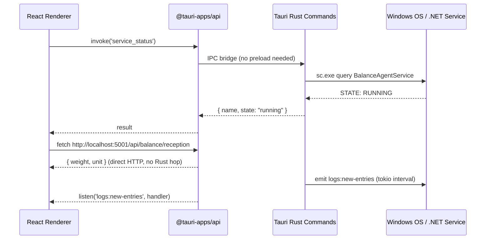

I have created the following plan after thorough exploration and analysis of the codebase. Follow the below plan verbatim. Trust the files and references. Do not re-verify what's written in the plan. Explore only when absolutely necessary. First implement all the proposed file changes and then I'll review all the changes together at the end.

## Observations

Your Electron app (`balance-dashboard`) is a well-structured React + TypeScript + Tailwind + Vite project. The Electron layer is cleanly separated: all privileged work lives in `electron/main/` (IPC handlers + utils), the renderer communicates exclusively through `window.api` (exposed via `contextBridge` in `electron/preload/index.ts`), and `src/shared/ipcChannels.ts` defines the contract. The main process handles: service control via `sc.exe`/PowerShell, INI config read/write to `C:\Windows\SysWOW64\`, COM port listing via `serialport`, Windows Event Log reading, history persistence via `app.getPath('userData')`, CSV export via `dialog.showSaveDialog`, and auto-updates via `electron-updater`.

## Approach

The migration replaces the Electron runtime with Tauri v2 (Rust backend + WebView2). The React/Vite/Tailwind frontend is reused entirely. Each Electron IPC handler is replaced by a Tauri command (Rust function). The `window.api` surface is replaced by `@tauri-apps/api` invoke calls, with a thin adapter layer in the frontend to minimize changes to existing pages and hooks.

---

## Phase 1 — Preparation

### 1.1 Audit: What to Remove vs. Replace

| Electron Layer | Tauri Equivalent |
|---|---|
| `electron/` directory (entire) | `src-tauri/` Rust crate |
| `electron/preload/index.ts` | Tauri JS API (`@tauri-apps/api/core`) |
| `electron-builder.json` | `src-tauri/tauri.conf.json` |
| `vite-plugin-electron` | `@tauri-apps/vite-plugin` |
| `electron-updater` | Tauri Updater plugin |
| `serialport` npm package | Tauri `serialport` plugin or Rust `serialport` crate |
| `ipcMain.handle` / `ipcRenderer.invoke` | `#[tauri::command]` + `invoke()` |
| `app.getPath('userData')` | Tauri `path` plugin (`appDataDir`) |
| `dialog.showSaveDialog` | Tauri `dialog` plugin |
| `BrowserWindow` | Tauri `WebviewWindow` (configured in `tauri.conf.json`) |

**Reused without modification:**
- All of `src/renderer/pages/` (all 5 pages)
- All of `src/components/` (StatusBadge, WeightGauge, LiveWeightChart)
- `src/renderer/store/appStore.ts`
- `src/renderer/hooks/useWeightPolling.ts`
- `src/App.tsx`, `src/main.tsx`, `src/index.css`, `src/App.css`
- `tailwind.config.js`, `postcss.config.cjs`
- `tsconfig.json`, `eslint.config.js`
- `index.html`

**Must be rewritten:**
- `electron/main/index.ts` → `src-tauri/src/main.rs` (app entry)
- `electron/preload/index.ts` → removed; replaced by `src/lib/tauriApi.ts` adapter
- `electron/main/ipc/*.ts` → `src-tauri/src/commands/*.rs`
- `electron/main/utils/serviceManager.ts` → Rust command using `std::process::Command`
- `electron/main/utils/iniConfig.ts` → Rust command using `std::fs` + `ini` crate
- `electron/main/utils/exec.ts` + `sudoExec.ts` → Rust `std::process::Command` with UAC elevation
- `electron/main/utils/historyManager.ts` → Rust command using Tauri `path` plugin + `serde_json`
- `electron/main/utils/comPorts.ts` → Rust `serialport` crate
- `electron/main/utils/http.ts` → removed; HTTP calls move to the React renderer directly (fetch API)
- `electron/main/update.ts` → Tauri Updater plugin
- `src/renderer/api/balanceApi.ts` → rewritten to use `invoke` instead of `window.api`
- `src/shared/ipcChannels.ts` → replaced by Tauri command name constants
- `electron-builder.json` → `src-tauri/tauri.conf.json` + `src-tauri/Cargo.toml`
- `vite.config.ts` → simplified (remove `vite-plugin-electron`, add `@tauri-apps/vite-plugin`)

### 1.2 Prerequisites

Verify the following are installed on the build machine:
- Rust toolchain (`rustup`) with `stable-x86_64-pc-windows-msvc` target
- Tauri CLI v2 (`cargo install tauri-cli --version "^2"`)
- WebView2 Runtime (already present on Windows 10/11)
- Node.js + npm (already in use)

---

## Phase 2 — Migration

### 2.1 Scaffold the Tauri Project

Run `cargo tauri init` inside `balance-dashboard/`. This generates `src-tauri/` alongside the existing `src/`. Accept the defaults for the Vite dev server URL and dist directory.

### 2.2 Update `vite.config.ts`

- Remove `vite-plugin-electron` and `vite-plugin-electron-renderer` imports and their plugin entries.
- Add `@tauri-apps/vite-plugin` as the replacement plugin.
- Keep the existing `resolve.alias`, `build.rollupOptions.output.manualChunks`, and React plugin unchanged.

### 2.3 Update `package.json`

- Remove from `devDependencies`: `electron`, `electron-builder`, `vite-plugin-electron`, `vite-plugin-electron-renderer`.
- Remove from `dependencies`: `electron-updater`, `serialport`.
- Add to `devDependencies`: `@tauri-apps/cli`, `@tauri-apps/vite-plugin`.
- Add to `dependencies`: `@tauri-apps/api`, `@tauri-apps/plugin-dialog`, `@tauri-apps/plugin-updater`, `@tauri-apps/plugin-shell`, `@tauri-apps/plugin-fs`, `@tauri-apps/plugin-path`.
- Update scripts: `"dev": "tauri dev"`, `"build": "tauri build"`.

---

## Phase 3 — Rust Backend (replaces `electron/main/`)

### 3.1 `src-tauri/Cargo.toml`

Add these dependencies:
- `tauri` with features `["protocol-asset", "window-data-drop"]`
- `tauri-plugin-dialog`
- `tauri-plugin-updater`
- `tauri-plugin-shell`
- `tauri-plugin-fs`
- `tauri-plugin-path`
- `serde` with `derive` feature
- `serde_json`
- `ini` (Rust crate for INI parsing)
- `serialport` (Rust crate)
- `tokio` with `full` feature (for async commands)
- `reqwest` with `json` feature (optional — see Phase 4)

### 3.2 Command Modules

Create `src-tauri/src/commands/` with the following modules, each mirroring the existing Electron IPC handlers:

#### `service.rs` (replaces `serviceHandlers.ts` + `serviceManager.ts`)

Expose these Tauri commands:
- `service_status` — runs `sc.exe query <name>` via `std::process::Command`, parses `STATE` line, returns `{ name, state }`.
- `service_start` — writes a temp `.ps1` file and runs it via `powershell.exe -Verb RunAs` (mirrors `sudoExec`).
- `service_stop` — same elevation pattern; includes the graceful-stop + force-kill logic from `serviceManager.ts`.
- `service_restart` — calls stop then start.
- `service_install` — locates `install.bat` from Tauri's resource directory (`tauri::api::path::resource_dir`), runs it via `cmd.exe /c`.

The UAC elevation pattern from `sudoExec.ts` translates directly: write a temp `.ps1` to `%TEMP%`, then invoke `Start-Process powershell.exe -Verb RunAs -Wait`.

#### `config.rs` (replaces `configHandlers.ts` + `iniConfig.ts`)

- `config_read` — reads `C:\Windows\SysWOW64\balances.ini` using `std::fs::read_to_string`, parses with the `ini` crate, returns the parsed map as JSON.
- `config_write` — merges incoming data with existing, serializes back to INI format, attempts direct `std::fs::write`; on `PermissionDenied`, falls back to the temp-file + `Move-Item -Verb RunAs` elevation pattern.
- Include the duplicate-cleanup logic (scan directory, keep most-recently-modified `balances*.ini`).

#### `com_ports.rs` (replaces `comPortHandlers.ts` + `comPorts.ts`)

- `com_ports_list` — uses the `serialport` Rust crate's `available_ports()` to enumerate COM ports, returns `Vec<ComPortInfo>`.
- `com_ports_test` — returns a disabled stub (same as current Electron implementation).

#### `logs.rs` (replaces `logHandlers.ts`)

- `logs_get_recent` — runs the PowerShell `Get-EventLog` script via `std::process::Command`, parses JSON output, returns `Vec<LogEntry>`.
- For the push-subscription (polling interval that sends events to the frontend): use a Tauri `Event` emitted from a background `tokio::spawn` task. The frontend subscribes via `listen('logs:new-entries', ...)` from `@tauri-apps/api/event` instead of the Electron `ipcRenderer.on` pattern.

#### `history.rs` (replaces `historyHandlers.ts` + `historyManager.ts`)

- `history_get` — reads `balance_history.json` from Tauri's `app_data_dir()`.
- `history_add` — appends a record (with duplicate check on timestamp + balanceName), writes back.
- `history_clear` — deletes the file.
- `history_export` — uses `tauri-plugin-dialog`'s `save` dialog to get a path, writes CSV.

#### `network.rs` (replaces the `getIps` handler in `apiHandlers.ts`)

- `network_get_ips` — enumerates network interfaces using the `if-addrs` or `local-ip-address` Rust crate (or via PowerShell `Get-NetIPAddress` as a simpler alternative), returns `Vec<String>` of non-loopback IPv4 addresses.

### 3.3 Register Commands in `main.rs`

In `src-tauri/src/main.rs`, register all commands with `.invoke_handler(tauri::generate_handler![...])` and initialize all plugins with `.plugin(tauri_plugin_dialog::init())` etc.

---

## Phase 4 — Frontend Integration (replaces `electron/preload/` and `window.api`)

### 4.1 API Adapter Layer

The key insight: `balanceApi.ts` currently calls `window.api.*` (the preload bridge). Replace this with a new adapter that calls Tauri's `invoke`.

**Rewrite `src/renderer/api/balanceApi.ts`:**
- Replace every `window.api.service.status()` → `invoke('service_status')`
- Replace every `window.api.config.read()` → `invoke('config_read')`
- Replace every `window.api.logs.subscribe()` → `listen('logs:new-entries', callback)` from `@tauri-apps/api/event`
- Replace every `window.api.history.export()` → `invoke('history_export')`
- All other calls follow the same `invoke('<command_name>', { ...args })` pattern.

This is the **only file** in `src/renderer/` that needs to change. All pages, hooks, and components remain untouched.

**Delete `src/shared/ipcChannels.ts`** — it is no longer needed. Tauri command names are plain strings passed to `invoke`.

**Delete `src/type/electron-updater.d.ts`** — no longer needed.

**Delete `src/demos/node.ts`** — Electron-specific Node.js demo.

### 4.2 API Communication (Balance REST API)

The HTTP calls to `http://[host]:5001/api/health` and `http://[host]:5001/api/balance/reception` currently go through the Electron main process (`apiHandlers.ts` → `fetchWithTimeout`). In Tauri, **move these HTTP calls directly to the React renderer** using the browser's native `fetch` API — this is safe because Tauri's WebView2 has no CORS restrictions for `http://localhost` targets.

- In `balanceApi.ts`, implement `balance.getHealth()` and `balance.getWeight()` as direct `fetch` calls reading the host/port from config (retrieved via `invoke('config_read')`).
- The `useWeightPolling.ts` hook requires **no changes** — it already calls `balanceApi.balance.getWeight()` abstractly.

### 4.3 Auto-Updater

Replace the `AppUpdater.tsx` component's `window.api.updater.*` calls with `@tauri-apps/plugin-updater` JS API (`check()`, `downloadAndInstall()`). The update UI component itself can be reused with minimal changes to its event wiring.

### 4.4 Remove Electron Type Declarations

- Remove `electron-env.d.ts` references.
- Remove the `window.api` global type declaration (previously injected by the preload). Add a `src/tauri-env.d.ts` if needed for any Tauri-specific globals.

---

## Phase 5 — Tauri Configuration for Windows

### 5.1 `src-tauri/tauri.conf.json`

Key settings to configure:

```
app.windows[0]:
  title: "Industrial Weighing Dashboard"
  width: 1280, height: 800
  resizable: true
  decorations: true

bundle:
  identifier: "com.balance.industrial-weighing-dashboard"
  productName: "Industrial Weighing Dashboard"
  version: "2.2.0"
  icon: ["icons/icon.ico", "icons/icon.png"]
  
  windows:
    wix: {}          ← for .msi
    nsis: {}         ← for .exe installer
    
  resources:
    - "../balances.ini"
    - "../install.bat"
    - "../BalanceAgentService.exe"

plugins:
  updater:
    pubkey: "<your-public-key>"
    endpoints: ["https://github.com/RidaGrimmer/BalanceAgentDashboard/releases/latest/download/latest.json"]
```

### 5.2 Windows Manifest (UAC)

In `src-tauri/`, create a `windows-manifest.xml` requesting `requireAdministrator` execution level (mirrors `electron-builder.json`'s `requestedExecutionLevel`). Reference it in `Cargo.toml` via the `winres` build dependency in `build.rs`.

### 5.3 NSIS Custom Script

The existing `build/installer.nsh` (NSIS include) that handles Windows Service installation must be migrated. Tauri's NSIS bundler supports custom hooks via `nsis.installerSidebar`, `nsis.preinstallSection`, and `nsis.postinstallSection` in `tauri.conf.json`. Port the service-installation logic from the existing `.nsh` file into Tauri's NSIS hook sections.

---

## Phase 6 — Packaging & Distribution

### 6.1 Build Targets

Configure `tauri.conf.json` to produce both NSIS (`.exe`) and WiX (`.msi`) installers for `x86_64-pc-windows-msvc`:

```
bundle.targets: ["nsis", "msi"]
```

Run `cargo tauri build --target x86_64-pc-windows-msvc`.

Output will be in `src-tauri/target/release/bundle/`.

### 6.2 Bundled Resources

The `extraResources` from `electron-builder.json` (`balances.ini`, `install.bat`, `BalanceAgentService.exe`) map directly to `bundle.resources` in `tauri.conf.json`. At runtime, access them via `tauri::api::path::resource_dir()` in Rust (same as the existing `process.resourcesPath` pattern in `serviceManager.ts`).

### 6.3 Expected Size Reduction

| | Electron | Tauri |
|---|---|---|
| Installer | ~240 MB | ~3–8 MB |
| Installed | ~850 MB | ~10–20 MB |

The Tauri binary uses the OS-provided WebView2 (already on Windows 10/11) instead of bundling Chromium.

---

## Phase 7 — Size Optimization Best Practices

- In `src-tauri/Cargo.toml`, set `[profile.release]` with `opt-level = "z"`, `lto = true`, `codegen-units = 1`, `strip = true`.
- Enable Tauri's `compress-dwarf` feature.
- Keep the Vite build's `manualChunks` strategy (already in `vite.config.ts`) — it correctly splits `recharts` and `lucide-react` into separate vendor chunks.
- Do not bundle `serialport` as an npm package — it is now handled entirely in Rust.
- Audit `dependencies` in `package.json` after migration; remove `ini`, `serialport`, `electron-updater` which are no longer needed on the JS side.

---

## Phase 8 — Risk Register & Mitigations

| Risk | Impact | Mitigation |
|---|---|---|
| UAC elevation in Rust | High | Mirror the `sudoExec.ts` pattern exactly: write temp `.ps1`, invoke `Start-Process -Verb RunAs -Wait`. Test with a non-admin user account. |
| `C:\Windows\SysWOW64\` write permissions | High | The fallback `Move-Item` elevation path in `config.rs` must be tested; SysWOW64 requires SYSTEM or admin. |
| WebView2 not installed on target machine | Medium | Add WebView2 bootstrapper to the NSIS installer (Tauri supports this natively via `nsis.installWebview2Mode: "downloadBootstrapper"`). |
| `serialport` Rust crate vs. npm `serialport` | Low | The COM port listing is read-only; the Rust `serialport` crate's `available_ports()` is a direct equivalent. |
| Log subscription (push events) | Medium | Replace `setInterval` + `win.webContents.send` with a `tokio::spawn` loop that calls `app_handle.emit("logs:new-entries", payload)`. Frontend uses `listen()` from `@tauri-apps/api/event`. |
| Auto-updater GitHub releases format | Medium | Tauri Updater requires a `latest.json` signature file generated by `tauri build`. Regenerate GitHub Actions workflow (`.github/workflows/build.yml`) to use `tauri-action` instead of `electron-builder`. |
| `dialog.showSaveDialog` for CSV export | Low | `tauri-plugin-dialog`'s `save()` is a direct equivalent. |
| `app.getPath('userData')` for history | Low | `tauri-plugin-path`'s `appDataDir()` resolves to the same `%APPDATA%\<identifier>` path. |

---

## Recommended Project Structure After Migration

```
balance-dashboard/
├── src/                          ← React frontend (mostly unchanged)
│   ├── App.tsx
│   ├── main.tsx
│   ├── renderer/
│   │   ├── api/
│   │   │   └── balanceApi.ts     ← REWRITTEN (invoke instead of window.api)
│   │   ├── hooks/
│   │   │   └── useWeightPolling.ts  ← unchanged
│   │   ├── pages/                ← all unchanged
│   │   ├── store/                ← unchanged
│   │   └── components/           ← unchanged
│   ├── components/               ← unchanged
│   └── lib/
│       └── utils.ts              ← unchanged
├── src-tauri/                    ← NEW: Rust backend
│   ├── Cargo.toml
│   ├── tauri.conf.json
│   ├── build.rs
│   ├── icons/
│   └── src/
│       ├── main.rs
│       └── commands/
│           ├── mod.rs
│           ├── service.rs
│           ├── config.rs
│           ├── com_ports.rs
│           ├── logs.rs
│           ├── history.rs
│           └── network.rs
├── vite.config.ts                ← UPDATED (tauri plugin)
├── package.json                  ← UPDATED (remove electron deps)
├── tailwind.config.js            ← unchanged
├── tsconfig.json                 ← unchanged
└── index.html                    ← unchanged
```

---

## Migration Sequence Diagram

