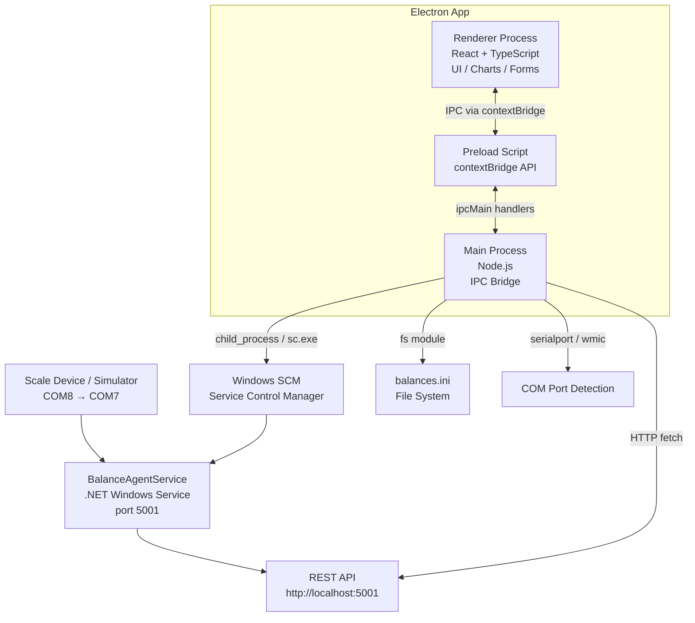

# BalanceAgentService APP

I have created the following plan after thorough exploration and analysis of the codebase. Follow the below plan verbatim. Trust the files and references. Do not re-verify what's written in the plan. Explore only when absolutely necessary. First implement all the proposed file changes and then I'll review all the changes together at the end.

## Observations

The existing `BalanceAgentService` is a .NET Windows service that:

- Reads from a COM port (configured in `balances.ini` with fields: `PortCom`, `BaudRate`, `DataBits`, `Parity`, `StopBits`, `Timeout`, `Unite`, `Decimales`)
- Exposes a REST API on `http://localhost:5001` (confirmed endpoints: `GET /api/health`)
- Is installed/managed via `sc.exe` commands and `install.bat`
- Logs to Windows Event Viewer
- Supports multiple scales via `NombreBalances` in the INI

The Electron app must wrap all interactions through this API and Windows system calls — never touching the COM port directly.

---

## Approach

Build the Electron + React + TypeScript app as a **monorepo** with a clear separation between the Electron main process (Node.js — handles OS calls, file I/O, service control, IPC) and the React renderer process (UI). All BalanceService API calls are proxied through the main process via IPC to avoid CORS and security issues. The project is scaffolded using **electron-vite** (the modern standard for Electron + Vite + React + TypeScript), which avoids the complexity of manual Webpack configuration.

---

## 1. Complete Software Architecture



---

## 2. Recommended Project Structure

```
balance-dashboard/
├── electron.vite.config.ts          # electron-vite build config
├── package.json
├── tsconfig.json
│
├── src/
│   ├── main/                        # Electron Main Process
│   │   ├── index.ts                 # App entry, BrowserWindow creation
│   │   ├── ipc/                     # IPC handler registration
│   │   │   ├── serviceHandlers.ts   # Start/Stop/Restart/Status
│   │   │   ├── configHandlers.ts    # Read/Write balances.ini
│   │   │   ├── apiHandlers.ts       # Proxy calls to BalanceService REST
│   │   │   ├── comPortHandlers.ts   # COM port enumeration
│   │   │   └── logHandlers.ts       # Windows Event Log streaming
│   │   └── utils/
│   │       ├── iniParser.ts         # INI read/write utility
│   │       ├── serviceManager.ts    # sc.exe / net commands wrapper
│   │       └── comPortScanner.ts    # COM port detection logic
│   │
│   ├── preload/
│   │   └── index.ts                 # contextBridge exposure of IPC APIs
│   │
│   └── renderer/                    # React App
│       ├── index.html
│       ├── main.tsx                 # React entry point
│       ├── App.tsx                  # Router + Layout
│       ├── api/
│       │   └── balanceApi.ts        # Typed wrappers around window.api IPC calls
│       ├── pages/
│       │   ├── Dashboard.tsx
│       │   ├── ServiceControl.tsx
│       │   ├── ConfigManager.tsx
│       │   ├── LogsViewer.tsx
│       │   ├── ComPortDetector.tsx
│       │   └── SetupWizard.tsx
│       ├── components/
│       │   ├── WeightGauge.tsx
│       │   ├── LiveWeightChart.tsx
│       │   ├── StatusBadge.tsx
│       │   ├── LogTable.tsx
│       │   ├── IniForm.tsx
│       │   └── ComPortList.tsx
│       ├── hooks/
│       │   ├── useWeightPolling.ts  # Polls /api/weight at interval
│       │   ├── useServiceStatus.ts  # Polls service state
│       │   └── useEventLog.ts       # Streams Windows Event Log entries
│       ├── store/
│       │   └── appStore.ts          # Zustand global state
│       └── styles/
│           └── globals.css
│
└── resources/
    └── icon.ico
```

---

## 3. Module Breakdown

| Module | Process | Responsibility |
|---|---|---|
| `serviceManager.ts` | Main | Wraps `sc.exe` / `net start\|stop` via `child_process.exec` |
| `iniParser.ts` | Main | Reads and writes `balances.ini` using a simple INI parser |
| `comPortScanner.ts` | Main | Enumerates COM ports via `wmic path Win32_SerialPort` or `serialport` npm package |
| `apiHandlers.ts` | Main | Proxies `fetch` calls to `http://localhost:5001/api/*` and returns results to renderer via IPC |
| `logHandlers.ts` | Main | Reads Windows Event Log via `Get-EventLog` PowerShell or tails a log file |
| `preload/index.ts` | Preload | Exposes a typed `window.api` object via `contextBridge` |
| `balanceApi.ts` | Renderer | Typed async functions calling `window.api.*` |
| `useWeightPolling.ts` | Renderer | React hook that polls weight data every N ms |
| `useServiceStatus.ts` | Renderer | React hook that polls service status every N ms |
| `appStore.ts` | Renderer | Zustand store holding weight, status, config, logs |
| `Dashboard.tsx` | Renderer | Composes gauge, chart, status badges, recent logs |
| `SetupWizard.tsx` | Renderer | Multi-step wizard (6 steps) with step state machine |
| `ConfigManager.tsx` | Renderer | Form bound to `balances.ini` fields, save triggers IPC write |
| `LogsViewer.tsx` | Renderer | Virtualized log list with filter input and error highlighting |

---

## 4. Suggested Libraries & Tools

| Category | Library | Reason |
|---|---|---|
| Scaffolding | `electron-vite` | Official Electron + Vite + React + TS template |
| UI Framework | `Ant Design` or `shadcn/ui` + `Tailwind CSS` | Industrial-grade, accessible components |
| Charts | `Recharts` | Lightweight, React-native charting |
| State Management | `Zustand` | Minimal boilerplate, perfect for Electron renderer |
| Routing | `React Router v6` | Page navigation within renderer |
| INI Parsing | `ini` (npm) | Lightweight INI read/write, no extra deps |
| COM Port Detection | `serialport` (npm, main process only) | Native Node.js serial port enumeration |
| HTTP Client | Native `fetch` (Node 18+) | Built into Electron's Node runtime |
| Log Virtualization | `react-window` | Efficiently renders thousands of log lines |
| Packaging | `electron-builder` | Creates NSIS Windows installer |
| Auto-update | `electron-updater` | Future-ready, pairs with `electron-builder` |

---

## 5. Step-by-Step Development Roadmap

### Phase 1 — Project Foundation

1. Scaffold the project with `electron-vite` using the React + TypeScript template
2. Configure `tsconfig.json` for both main and renderer targets
3. Set up `electron-builder` in `package.json` for Windows NSIS packaging
4. Establish the `contextBridge` / `ipcMain` / `ipcRenderer` communication skeleton in `preload/index.ts` and `main/index.ts`
5. Define all IPC channel names as a shared constants file (`src/shared/ipcChannels.ts`) to avoid string typos

### Phase 2 — Main Process Core Services

6. Implement `serviceManager.ts`: wrap `sc query`, `sc start`, `sc stop`, `net start`, `net stop` using `child_process.exec` with proper error handling and output parsing
2. Implement `iniParser.ts`: read `balances.ini` from a configurable path (default: same directory as the service EXE), parse all `[Balance<N>]` sections, and write back safely (write to temp file, then rename)
3. Implement `comPortScanner.ts`: use the `serialport` npm package's `SerialPort.list()` to enumerate available COM ports and return their names and descriptions
4. Implement `apiHandlers.ts`: proxy `GET /api/health` and `GET /api/weight` (and any other endpoints) to `http://localhost:5001`, return structured results including HTTP status and body
5. Implement `logHandlers.ts`: use PowerShell `Get-EventLog -LogName Application -Source BalanceAgentService -Newest 100` via `child_process.exec` to fetch recent log entries; set up a polling interval and push new entries to the renderer via `webContents.send`

### Phase 3 — IPC Registration & Preload

11. Register all IPC handlers in `main/ipc/` files and call them from `main/index.ts`
2. Expose a fully typed `window.api` object in `preload/index.ts` covering: `service.*`, `config.*`, `comPorts.*`, `balance.*`, `logs.*`
3. Create `src/renderer/api/balanceApi.ts` with typed async wrappers for every `window.api` call

### Phase 4 — React UI Shell

14. Set up `React Router v6` with routes for: `/`, `/service`, `/config`, `/logs`, `/ports`, `/setup`
2. Build the main layout shell: sidebar navigation, header with connection status indicator, content area
3. Implement `StatusBadge` component (Running/Stopped/Unknown states with color coding)
4. Set up `Zustand` store (`appStore.ts`) with slices for: `weight`, `serviceStatus`, `config`, `logs`, `comPorts`

### Phase 5 — Dashboard Page

18. Implement `useWeightPolling` hook: calls `balanceApi.getWeight()` on a configurable interval (default 1000ms), updates Zustand store, handles API-down gracefully
2. Implement `useServiceStatus` hook: polls `balanceApi.getServiceStatus()` every 5 seconds
3. Build `WeightGauge` component: large numeric display with unit (kg), color-coded by threshold
4. Build `LiveWeightChart` using `Recharts` `LineChart`: rolling 60-second window of weight readings stored in local component state
5. Compose `Dashboard.tsx`: weight gauge, live chart, service status badge, COM port display, API connection indicator, last 10 log entries

### Phase 6 — Service Control Page

23. Build `ServiceControl.tsx`: four action buttons (Start, Stop, Restart, Check Status), current status display, confirmation dialog before Stop/Restart
2. Wire buttons to `balanceApi.startService()`, `stopService()`, `restartService()`, `getServiceStatus()`
3. Show operation result feedback (success/error toast notifications)

### Phase 7 — Configuration Manager

26. Build `IniForm.tsx`: a form with fields mapped to all `balances.ini` keys (`PortCom`, `BaudRate`, `DataBits`, `Parity`, `StopBits`, `Timeout`, `Unite`, `Decimales`, `NombreBalances`)
2. On page load, call `balanceApi.readConfig()` to populate form fields
3. On save, validate inputs (COM port format, numeric fields), call `balanceApi.writeConfig()`, show success/error feedback
4. Add a warning banner: "Restart BalanceService after saving configuration changes"

### Phase 8 — COM Port Detection

30. Build `ComPortList.tsx`: displays detected ports in a table (port name, description, manufacturer)
2. Add a "Refresh" button that calls `balanceApi.listComPorts()`
3. Add a "Test Connection" button that attempts to open the selected port briefly and reports success/failure (via main process using `serialport`)
4. Add a "Use this port" button that pre-fills the COM port field in the Config Manager

### Phase 9 — Logs Viewer

34. Build `LogTable.tsx` using `react-window` for virtualized rendering of potentially thousands of log lines
2. Implement filter input (text search across log message)
3. Implement severity filter (Info / Warning / Error)
4. Highlight error rows in red, warning rows in amber
5. Implement `useEventLog` hook that receives pushed log entries from main process via `ipcRenderer.on('logs:new-entries', ...)`

### Phase 10 — Setup Wizard

39. Build `SetupWizard.tsx` as a 6-step state machine using a `currentStep` state variable
2. **Step 1 – Welcome**: display app name, version, brief description, "Next" button
3. **Step 2 – Detect COM Ports**: render `ComPortList`, allow user to select a port, store selection in wizard state
4. **Step 3 – Test Scale Connection**: attempt a brief serial open on the selected port, display result (success/timeout/error)
5. **Step 4 – Configure API Settings**: form for API URL (default `http://localhost:5001`), test connection button that calls `GET /api/health`
6. **Step 5 – Install / Configure Service**: display `install.bat` instructions, button to trigger `balanceApi.writeConfig()` with wizard-collected values, button to start service
7. **Step 6 – Finish**: summary of configured settings, "Go to Dashboard" button

### Phase 11 — Packaging & Distribution

46. Configure `electron-builder` in `package.json`: target NSIS installer for Windows, set app ID, product name, icon
2. Bundle `balances.ini` and `install.bat` as extra resources in the installer
3. Set the app to request elevated privileges where needed (UAC manifest for service control operations)
4. Add `electron-updater` scaffolding for future auto-update support

---

## 6. IPC Channel Contract

```
service:start          → void
service:stop           → void
service:restart        → void
service:status         → { state: 'running' | 'stopped' | 'unknown' }

config:read            → BalancesConfig (typed object)
config:write           → { success: boolean; error?: string }

comPorts:list          → ComPortInfo[]
comPorts:test          → { success: boolean; error?: string }

balance:getWeight      → { weight: number; unit: string; timestamp: string }
balance:getHealth      → { status: 'ok' | 'error'; message?: string }

logs:subscribe         → (push channel, no return)
logs:unsubscribe       → void
logs:getRecent         → LogEntry[]
```

---

## 7. Best Practices for Industrial Desktop Applications

| Concern | Practice |
|---|---|
| **Security** | Enable `contextIsolation: true`, `nodeIntegration: false`; all Node.js access only through `contextBridge` |
| **Resilience** | All API calls must have timeouts and graceful degradation; show "Service Offline" state, not a crash |
| **Config Safety** | Write INI changes to a `.tmp` file first, then atomically rename to avoid corruption on power loss |
| **Privilege Handling** | Service control (`sc.exe`) requires admin; use `runas` or prompt UAC elevation only for those specific operations |
| **Polling vs. WebSocket** | Use polling (1s interval) for weight data since the existing API is REST-only; switch to WebSocket if the API is extended in the future |
| **Error Visibility** | All errors must surface in the UI with actionable messages (e.g., "Cannot connect to API — is BalanceService running?") |
| **Log Rotation** | When tailing Windows Event Log, cap in-memory log buffer to last 1000 entries to prevent memory growth |
| **Offline Mode** | Cache last known weight and config in Electron's `app.getPath('userData')` so the UI is usable even when the service is temporarily down |
| **Accessibility** | Use semantic HTML and ARIA labels; operators may use the app in noisy industrial environments with gloves |
